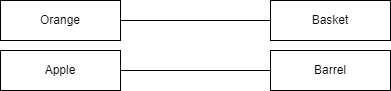
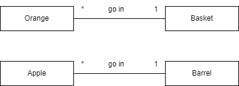
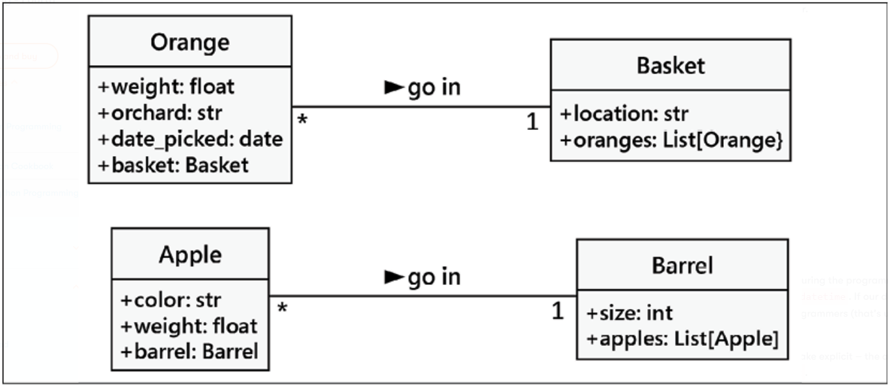

# Resumen orientación a objetos con Python

## Diseño orientado a objetos

En el desarrollo de software, el diseño es un paso que se termina antes de programar. Pero en la realidad no es así, analizar, programar y diseñar van de la mano durante todo el proceso.

## Introducción

- Todos sabemos lo que son los objetos: algo tangible, que podemos sentir y manipular. Dentro del software formalmente, un objeto es una colección de **información** y **comportamientos**
- **Analisis orientado a objetos (OOA)**: Es el proceso que observa un problema, sistema o tarea y identifica objetos y intereacciones entre ellos. El resultado obtenido de la etapa de OOA es una descripción del sistema, a menudo en forma de requerimientos. En algunos casos análisis es un nombre equivocado, ya que cuenta con entrevistas, estudiar el proceso y la eliminación de posibilidades.
- **Diseño orientado a objetos (OOD)**: Es el proceso de convertir los requerimientos en una especificación de implementación. El diseñador busca los nombres de los objetos, define los comportamientos, y especifica formalmente como los objetos pueden interacturar con otros objetos. La etapa del diseño trata sobre transformar el que vamos a hacer en como lo vamos a hacer.
- **Programación orientada a objetos (OOP)**: Es el proceso de convertir el diseño en un programa que contendra el producto solicitado.
- Es importante saber que sería ideal seguir las etapas, pero el mundo real no lo permite, es común que en la parte de diseño no este bien clarificada las funciones. Se buscara utilizar el desarrollo iterativo (el desarrollo en cascada no funciona muy bien). El cual busca que se tomen pequeñas partes de una tarea para modelar, diseñar y programar, luego se valida y se expande incluyendo nuevas funcionalidades en una serie de pequeños ciclos de desarrollo

## Objetos y clases

- Las clases son como maquetas, planos para crear objetos.Por ejemplo si tuvieramos una clase llamada **Orange**, podriamos crear tantos objetos como queramos así tendriamos Orange1, Orange2, Orange3, etc. pero todos ellos son creados gracias a la clase **Orange**, estos objetos creados tambien son conocidos como **instancias de la clase**
- Para describir la relación entre los objetos del sistema existen los diagramas de clases (UML).  
    
  Diagrama de clases donde la clase Orange tiene una relación de asosiación con Basket, y Apple tiene una relación de asociación con Barrel
- UML puede ser bastante opcional.  
    
  Se agrego la cardinalidad y una frase que describe la relación entre ellas que podría traducirse como `n orange se guardan en un basket`

## Especificando atributos y comportamientos

- Hasta ahora sabemos que los objetos son instancias de las clases, y las clases pueden relacionarse entre sí, una instancia de clase es un objeto especifico que tiene su propio conjunto de información y comportamientos.

- El conjunto de información puede tener estados que varían entre diferentes instancias de clase. Por ejemplo una naranja tiene un peso diferente a otra naranja. Esto es conocido como los atributos, propiedades o miembros (instance variable in python).

- En UML podemos especificar tanto como queramos
    
   `+` indica que es un atributo público  
  `:type` indica el tipo de dato que tendrá el atributo
  `atributos implicitos` Describen la relación que tienen los objetos en este caso `+ basket: Basket`
